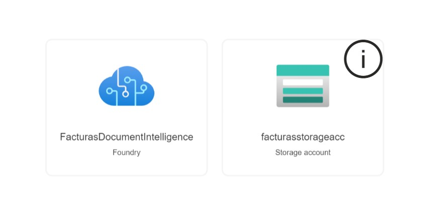
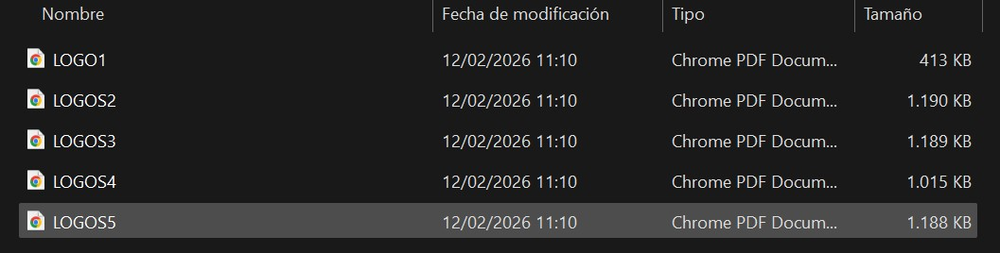
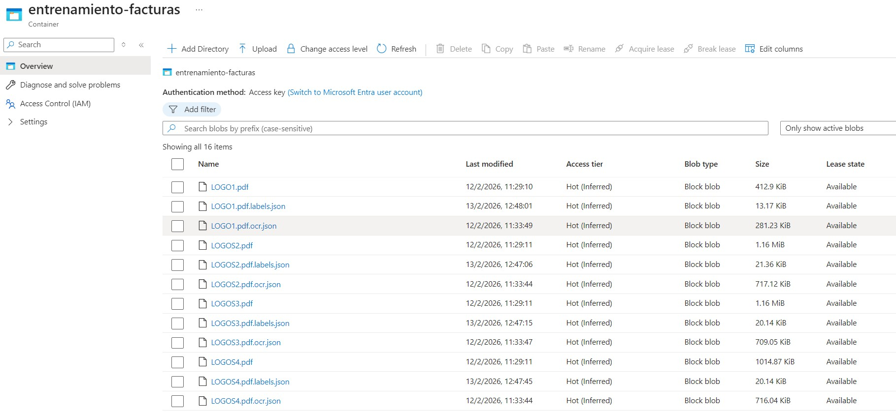
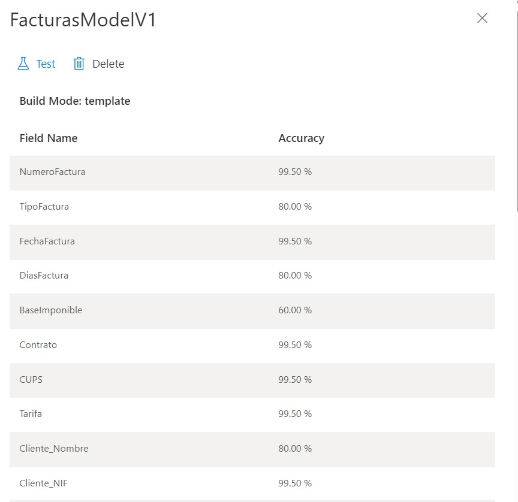
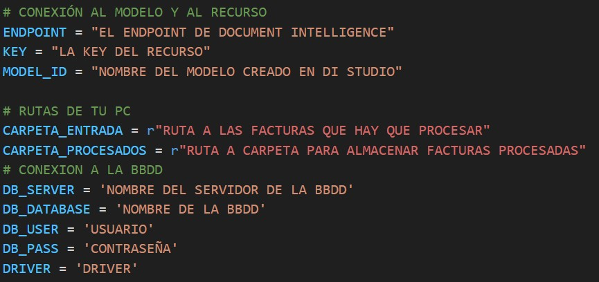
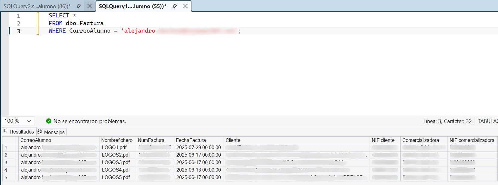

# 📄 FacturasDocumentIntelligence

### Procesamiento Automatizado de Facturas Energéticas con Azure AI

> **🚀 VISTA RÁPIDA:** Puedes consultar el código del script principal (ETL) aquí: [**🐍 main.py**](./main.py)

---

## 📖 Sobre el Proyecto

**FacturasDocumentIntelligence** es un proyecto **académico** que implementa una solución ETL (*Extract, Transform, Load*) real para la digitalización automatizada de facturas de suministros (Luz y Gas).

El objetivo principal es eliminar la gestión manual de documentos utilizando servicios cognitivos en la nube. Mediante un **Modelo Neuronal Personalizado** (Custom Neural Model), el sistema es capaz de extraer más de 40 datos complejos —como tablas de potencias, periodos tarifarios (P1-P6) y códigos CUPS— e insertarlos estructuradamente en una base de datos SQL.

---

## ☁️ Infraestructura Cloud (Azure)

El despliegue se ha realizado íntegramente en Microsoft Azure, utilizando una arquitectura *Serverless* y servicios PaaS para garantizar la escalabilidad.

> **Fig 1.** *Grupo de recursos creado en Azure: Se observa el recurso de **Document Intelligence** (Motor de IA) y la **Storage Account** necesaria para alojar los datasets de entrenamiento.*

---

## 🧠 Entrenamiento del Modelo IA

Para lograr una alta precisión en documentos no estandarizados, se ha entrenado un modelo específico utilizando **Azure Document Intelligence Studio**.

### 1. Dataset de Entrenamiento
Se ha recopilado un conjunto de facturas reales para enseñar al modelo a generalizar la ubicación de los datos.

> **Fig 2.** *Muestra de las 5 facturas utilizadas para el entrenamiento del modelo.*

### 2. Ingesta y Etiquetado (Blob Storage)
Los documentos se cargan en un contenedor de Azure Blob Storage, que actúa como fuente de datos para la herramienta de etiquetado.

> **Fig 3.** *Vista del contenedor en la Storage Account. Se muestran los archivos PDF junto con sus ficheros de etiquetas (`.ocr`, `.labels`) generados tras el proceso de entrenamiento.*

### 3. Validación y Precisión
Una vez entrenado, el modelo ofrece métricas de confianza para cada etiqueta definida.

> **Fig 4.** *Panel de resultados del entrenamiento. Se observa la precisión, validando la viabilidad del modelo.*

---

## ⚙️ El Motor de Procesamiento (Python Script)

La orquestación del proceso se realiza mediante un script en **Python** que conecta el entorno local con la nube y la base de datos.

### Configuración y Conexión
El script utiliza el SDK de Azure (`azure-ai-documentintelligence`) y `pyodbc` para la persistencia de datos. Gestiona automáticamente el flujo de archivos entre carpetas locales.

> **Fig 5.** *Fragmento del código fuente `main.py` donde se configuran:*
> * *Credenciales del recurso de Azure y conexión a SQL Database.*
> * *Rutas del sistema de archivos: Carpeta de entrada (para procesar) y carpeta de salida (procesados).*

**Flujo lógico del Script:**
1.  **Watchdog:** Detecta nuevos PDFs en la carpeta local.
2.  **Extracción:** Envía el documento a la API de Azure.
3.  **Transformación:** Normaliza fechas, limpia símbolos de moneda y gestiona nulos (Lógica diferenciada para Luz vs Gas).
4.  **Carga:** Inserta los datos limpios en SQL Server.
5.  **Limpieza:** Mueve el archivo procesado para evitar duplicidades.

---

## 🗄️ Persistencia y Validación (SQL Server)

Los datos extraídos se almacenan en una base de datos relacional **Azure SQL Database** (en mi caso una base de datos compartida con mis compañeros, dado que es un proyecto académico). Para la gestión y verificación de los datos, utilizamos **SSMS (SQL Server Management Studio)**.

> **Fig 6.** *Consulta de validación en SSMS. Se filtra por el campo identificativo del alumno (`CorreoAlumno`) para verificar la correcta inserción de los registros. Se puede apreciar cómo el sistema ha rellenado correctamente campos complejos como las potencias contratadas desglosadas por periodos.*

---

## ✨ Características Principales

* **🧠 Modelo Híbrido:** Un único modelo capaz de interpretar facturas de **Luz** (con 6 periodos horarios) y **Gas** (términos fijos y variables) simultáneamente.
* **🛡️ Normalización de Datos:** Algoritmos propios para convertir fechas en lenguaje natural (ej: "17 de junio") a formato estándar SQL (`YYYY-MM-DD`).
* **📂 Gestión Automática:** Sistema de movimiento de archivos para mantener el entorno de trabajo limpio.
* **🎓 Identificación Académica:** Trazabilidad de los registros mediante el correo del alumno.

---

## 🛠️ Tecnologías Utilizadas

* **Lenguaje:** Python 3.13
* **Cloud Services:** Azure Document Intelligence, Azure Blob Storage.
* **Base de Datos:** Azure SQL Database.
* **Herramientas:** VS Code, SQL Server Management Studio (SSMS).
* **Inteligencia Artificial:** Gemini.

---
*Desarrollado por Alejandro Benítez*
