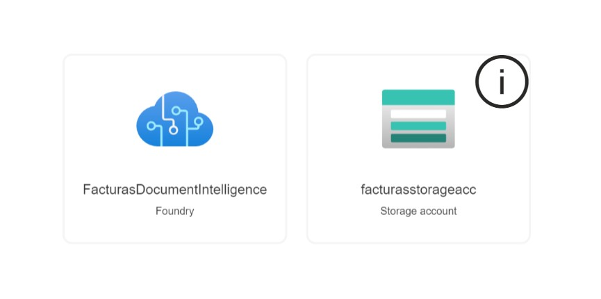
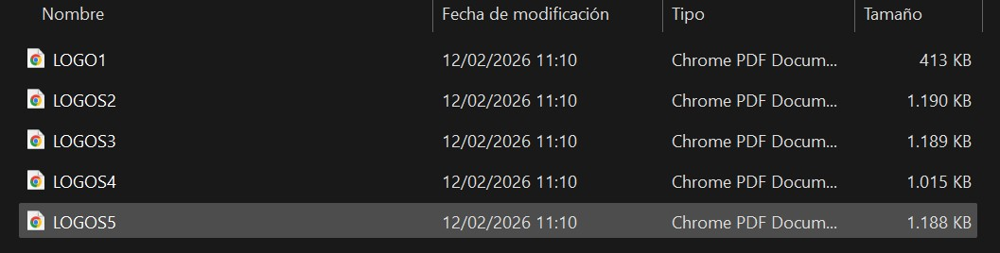
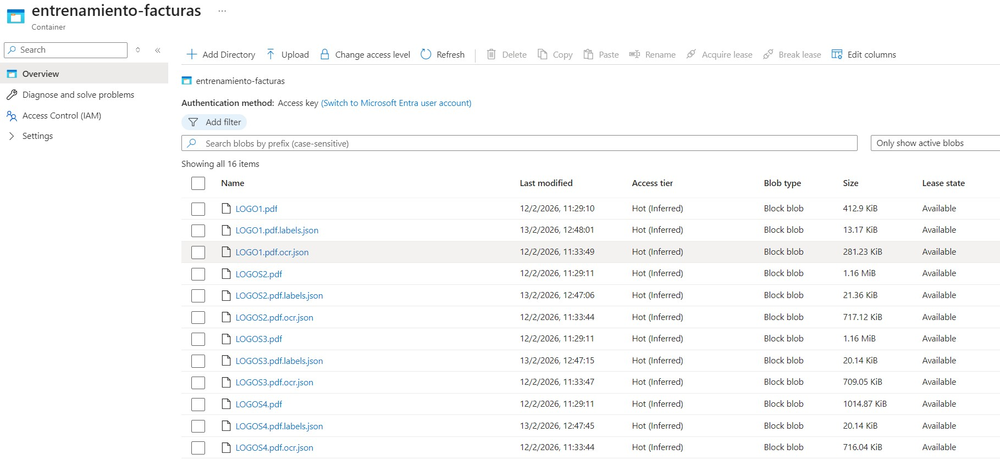
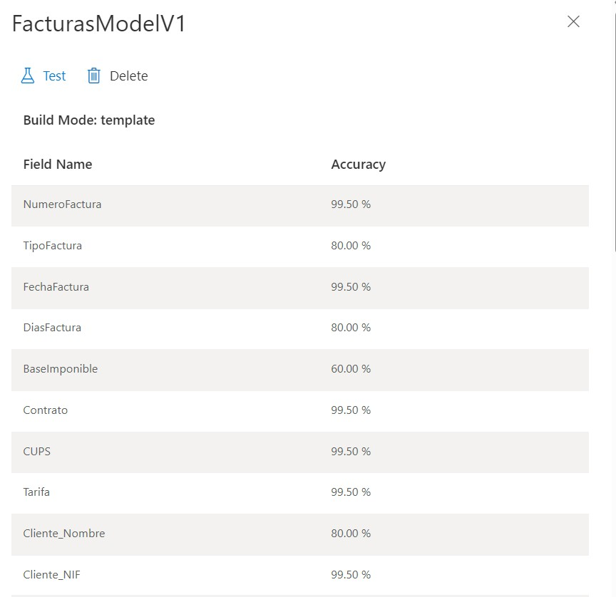
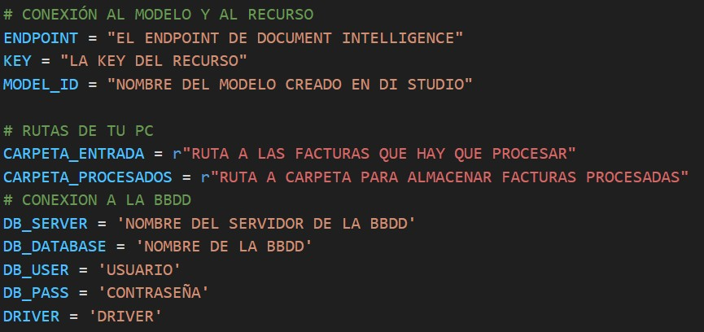
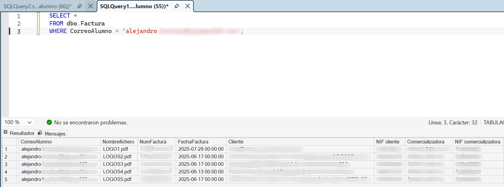

# 📄 FacturasDocumentIntelligence

### Automated Processing of Energy Invoices with Azure AI

> **🚀 QUICK VIEW:** You can check the main script (ETL) code here: [**🐍 main.py**](./main.py)

---

## 📖 About the Project

**FacturasDocumentIntelligence** is an **academic** project that implements a real-world ETL (*Extract, Transform, Load*) solution for the automated digitization of utility invoices (Electricity and Gas).

The primary goal is to eliminate manual document management using cloud-based cognitive services. By utilizing a **Custom Neural Model**, the system is capable of extracting over 40 complex data points—such as power tables, billing periods (P1-P6), and CUPS codes—and inserting them into a structured SQL database.

---

## ☁️ Cloud Infrastructure (Azure)

The deployment was carried out entirely on Microsoft Azure, using a *Serverless* architecture and PaaS services to ensure scalability.

> **Fig 1.** *Resource group created in Azure: Includes the **Document Intelligence** resource (AI Engine) and the **Storage Account** required to host the training datasets.*

---

## 🧠 AI Model Training

To achieve high precision in non-standardized documents, a specific model was trained using **Azure Document Intelligence Studio**.

### 1. Training Dataset
A set of real invoices was compiled to teach the model how to generalize data locations.

> **Fig 2.** *Sample of the 5 invoices used for model training.*

### 2. Ingestion and Labeling (Blob Storage)
Documents are uploaded to an Azure Blob Storage container, which serves as the data source for the labeling tool.

> **Fig 3.** *View of the Storage Account container. Shows the PDF files along with their label files (`.ocr`, `.labels`) generated after the training process.*

### 3. Validation and Accuracy
Once trained, the model provides confidence metrics for each defined tag.

> **Fig 4.** *Training results panel. Accuracy is observed, validating the model's viability.*

---

## ⚙️ The Processing Engine (Python Script)

The process orchestration is handled by a **Python** script that connects the local environment with the cloud and the database.

### Configuration and Connection
The script uses the Azure SDK (`azure-ai-documentintelligence`) and `pyodbc` for data persistence. It automatically manages the file flow between local folders.

> **Fig 5.** *Snippet of the `main.py` source code where the following are configured:*
> * *Azure resource credentials and SQL Database connection.*
> * *File system paths: Input folder (to process) and output folder (processed).*

**Script Logical Flow:**
1. **Watchdog:** Detects new PDFs in the local folder.
2. **Extraction:** Sends the document to the Azure API.
3. **Transformation:** Normalizes dates, cleans currency symbols, and handles nulls (Differentiated logic for Electricity vs. Gas).
4. **Load:** Inserts cleaned data into SQL Server.
5. **Cleanup:** Moves the processed file to avoid duplication.

---

## 🗄️ Persistence and Validation (SQL Server)

Extracted data is stored in a relational **Azure SQL Database** (in this case, a database shared with classmates, given it is an academic project). For data management and verification, we use **SSMS (SQL Server Management Studio)**.

> **Fig 6.** *Validation query in SSMS. Filtering by the student identification field (`CorreoAlumno`) to verify correct record insertion. It can be seen how the system has correctly filled complex fields such as contracted power broken down by periods.*

---

## ✨ Main Features

* **🧠 Hybrid Model:** A single model capable of interpreting **Electricity** invoices (with 6 time periods) and **Gas** invoices (fixed and variable terms) simultaneously.
* **🛡️ Data Normalization:** Custom algorithms to convert natural language dates (e.g., "17 de junio") into standard SQL format (`YYYY-MM-DD`).
* **📂 Automatic Management:** File movement system to keep the workspace clean.
* **🎓 Academic Identification:** Record traceability using the student's email.

---

## 🛠️ Technologies Used

* **Language:** Python 3.13
* **Cloud Services:** Azure Document Intelligence, Azure Blob Storage.
* **Database:** Azure SQL Database.
* **Tools:** VS Code, SQL Server Management Studio (SSMS).
* **Artificial Intelligence:** Gemini.

---
*Developed by [Alejandro Benitez](https://github.com/alejandrobtez)*

## 📄 License

This project is licensed under the MIT License - see the [LICENSE](LICENSE) file for details.
